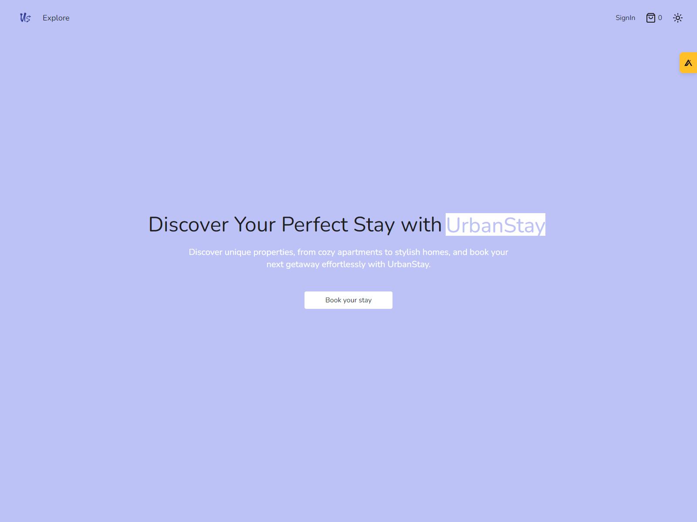
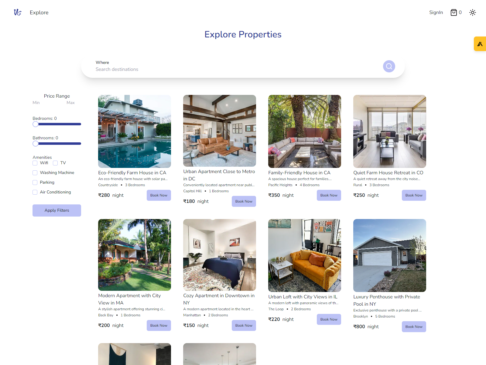
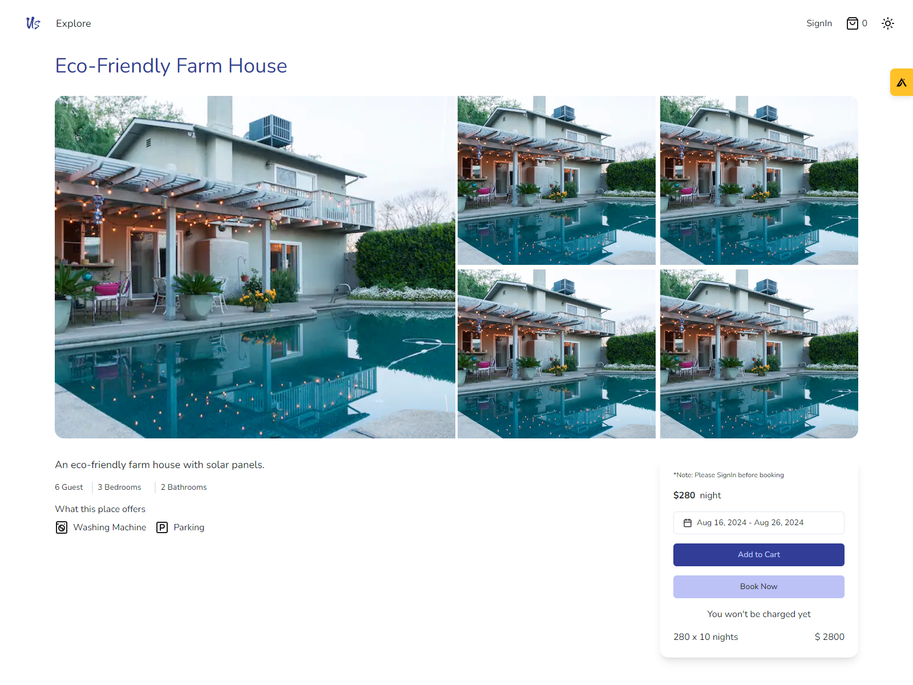
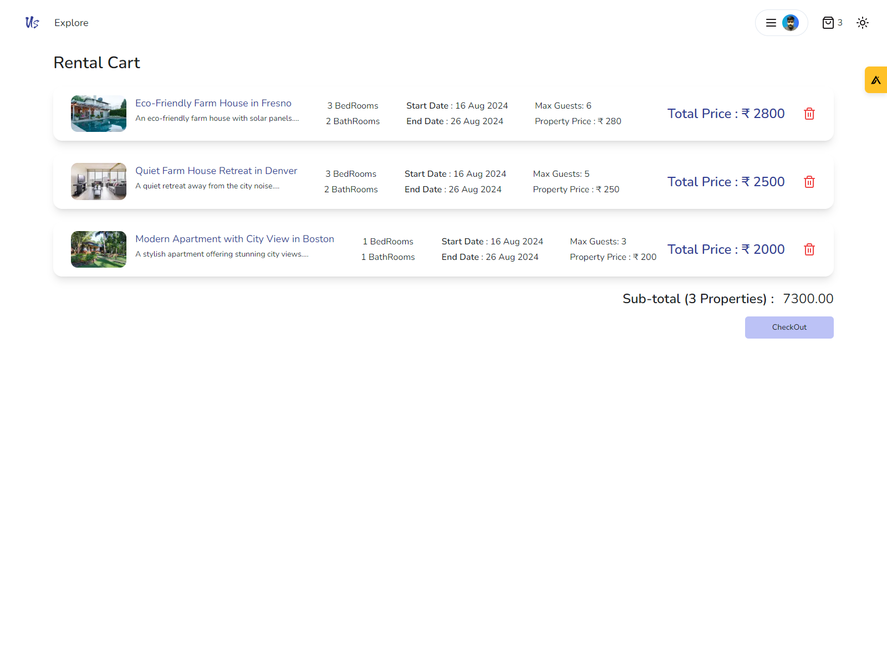
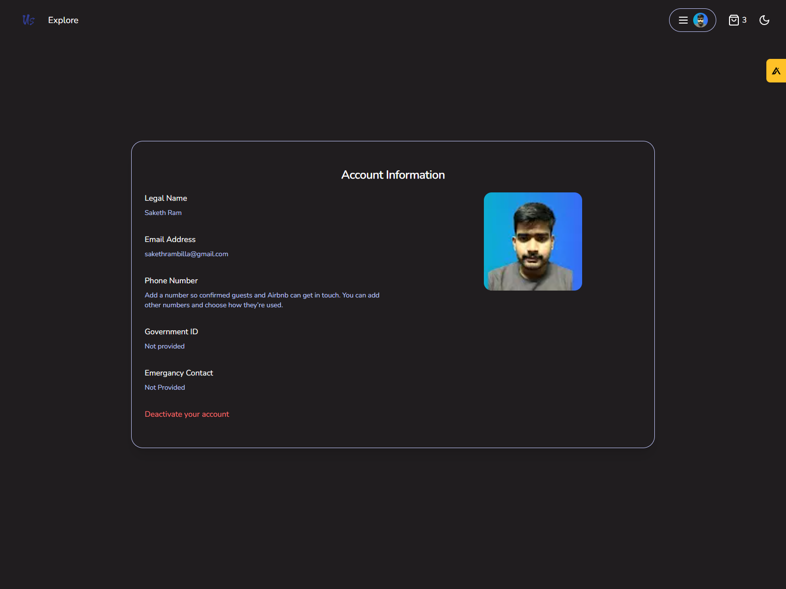
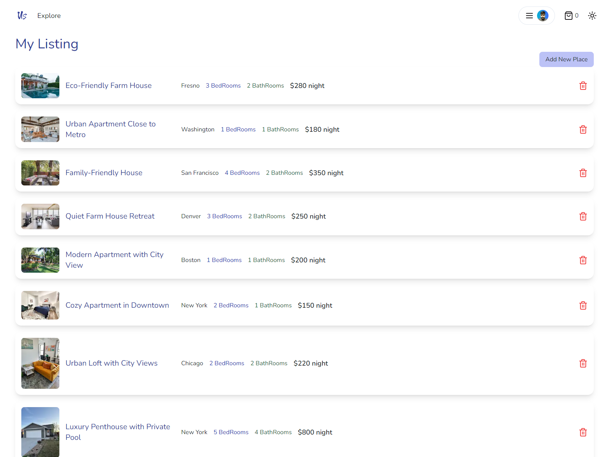

#  Urban Stay : Property Booking Application

Welcome to the Property Booking Application! This project is a Next.js application designed to provide a seamless experience for users to book properties, similar to platforms like Airbnb. The application is built with modern web technologies, including Next.js, TypeScript, Prisma, and Neon, and features robust authentication and user management with NextAuth.js.

## Features

- **User Authentication** : Secure login with Google using NextAuth.js.
- **Property Listings** : Browse and search for properties available for booking.
- **Hotel Booking** : Easily book your desired property with a few clicks.
- **Add to Cart** : Save properties to your cart for quick access and booking later.
- **Profile Section** : Manage your profile details and preferences.
- **My Bookings** : View and manage your bookings from a dedicated section.
- **My Property Listings** : List your own properties and manage them from your profile.


## Tech Stack
Tyescript, NextJs, Zustand, TailwindCSS, Shadcn UI, NextAuth, Prisma ORM.


## Environment Variables

To run this project, you will need to add the following environment variables to your .env file

```
GOOGLE_CLIENT_ID=""
GOOGLE_CLIENT_SECRET=""
NEXTAUTH_SECRET=""
DATABASE_URL=""
```
## Run Locally

Clone the project

```bash
  git clone https://github.com/sakethrambilla/totality-frontend-challenge
```

Go to the project directory


```bash
  cd totality-frontend-challenge
```

Install dependencies

```bash
  npm install
```

Start the server

```bash
  npm run dev
```


## Deployment

Project is deployed at: https://totality-frontend-challenge-1.vercel.app/


## Screenshots









